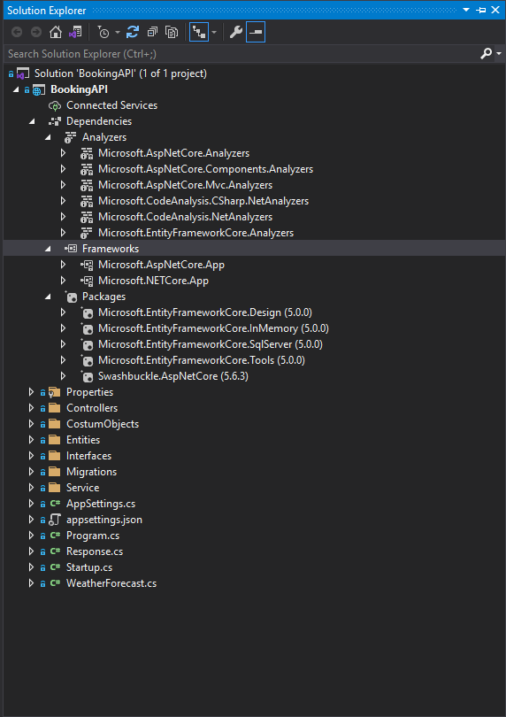
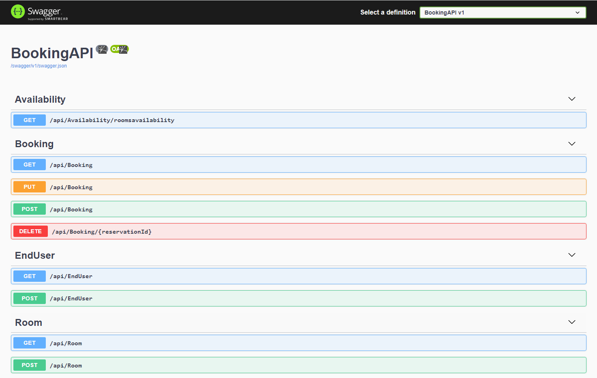
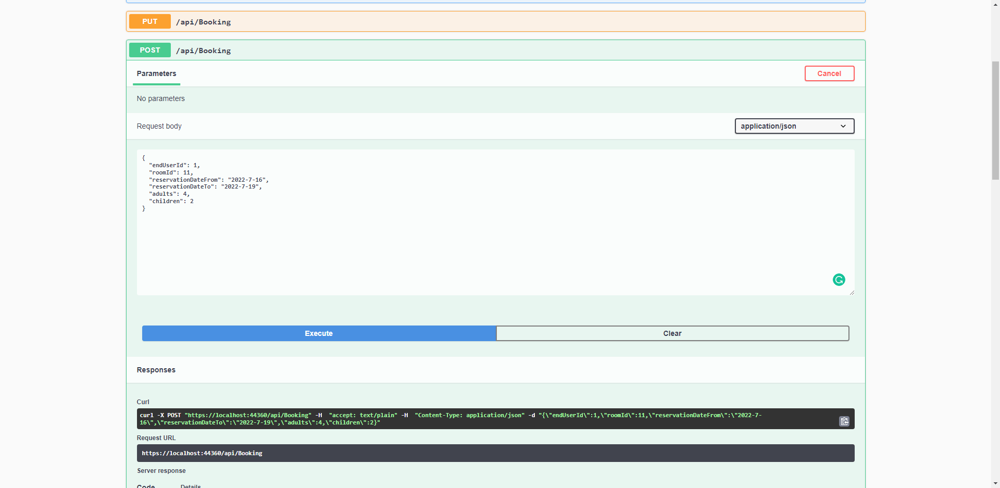
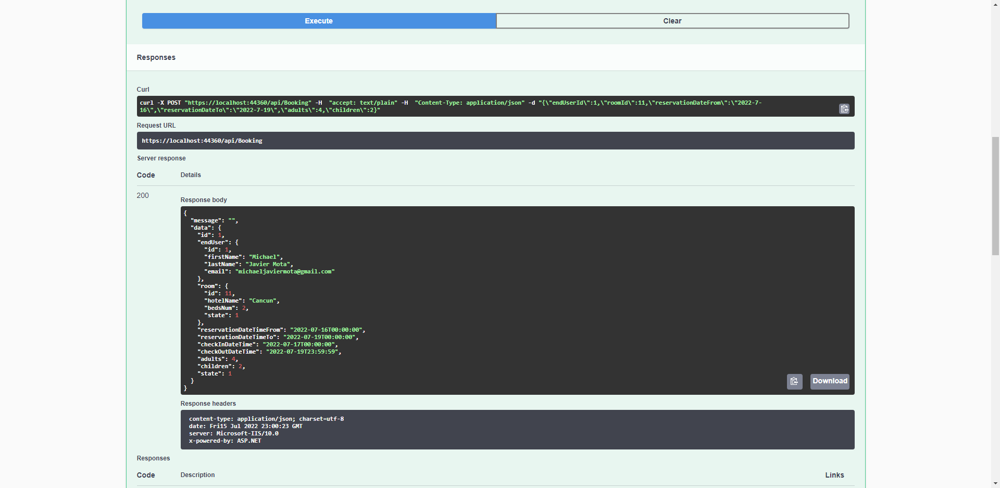

# BookingAPI GUIDE

#### Operations allowed by this api
1. - For the purpose of the test, we assume the hotel has only one room available
2. - To give a chance to everyone to book the room, the stay can’t be longer than 3 days
3. -and can’t be reserved more than 30 days in advance.
4. - All reservations start at least the next day of booking,
5. - To simplify the use case, a “DAY’ in the hotel room starts from 00:00 to 23:59:59.
6. - Every end-user can check the room availability,
7. - place a reservation
8. - cancel a reservation
9. - modify a reservation.

**The database has a table architecture:**
* EndUsers
* Rooms
* Reservations

##### TECHNICAL SPECIFICATIONS FOR DEVELOPMENT
* Visual Studio 2019
* .net core 5
* Microsoft.EntityFrameworkCore.SqlServer {5.0.0}
* Microsoft.EntityFrameworkCore.Design    {5.0.0}
* Swashbuckle.AspNetCore                  {5.6.3}
* Microsoft.EntityFrameworkCore.InMemory  {5.0.0}
* Microsoft.EntityFrameworkCore.Tools     {5.0.0}
* Swagger
 

##### STEPS TO START THE PROJECT

> **Two ways to work with the database in this web API are:**
1. In memory
2. Microsoft SQL Server 2012 i

##### Note
To select one or another database go to the appsettings.json file and in the property

  "AppSettings": {
     "DataBaseInMemory": "yes"
   }

can change value yes or no.
If you want the database in memory type "yes", if you want it in Microsoft Sql server type "no".

1. **With the in-memory database you don't need an instance of sql server.**

2. **If you use sql server you must put your credentials and that the user has sisadmin permissions of the database. 
"ConnectionStrings": {
     "DefaultConnectionString": " User= ; password= ;MultipleActiveResultSets=True; initial catalog=_BookingAPI_5142TE_MJM_ST42024245_842472115157_; Data Source=DGCP-SRV-SQDHW"
   }**

3. **Every time the web API is run, the system deletes the database "_BookingAPI_5142TE_MJM_ST42024245_842472115157_" that it created and recreates it and performs a migration of tables and populates them.**

#### Examples Request:

##### JSON Create Booking:
> {
> "endUserId": 1,
> "roomId": 11,
> "reservationDateFrom": "2022-7-16",
> "reservationDateTo": "2022-7-19",
> "adults": 4,
> "children": 2
> }

##### JSON To Modify a Booking

> {
> "id": 1,
> "endUser": {
> "id": 1,
> "firstName": "Michael Modificado",
> "lastName": "Javier Mota",
> "email": "michaeljaviermota@gmail.com"
> },
> "room": {
> "id": 11,
> "hotelName": "Cancun",
> "bedsNum": 2,
> "state": 1
> },
> "reservationDateTimeFrom": "2022-07-16T00:00:00",
> "reservationDateTimeTo": "2022-07-19T00:00:00",
> "checkInDateTime": "2022-07-17T00:00:00",
> "checkOutDateTime": "2022-07-19T23:59:59",
> "adults": 4,
> "children": 2,
> "state": 1
> }

#### Images

##### Libraries

##### End Points

##### Creating  a Book

##### End Points

